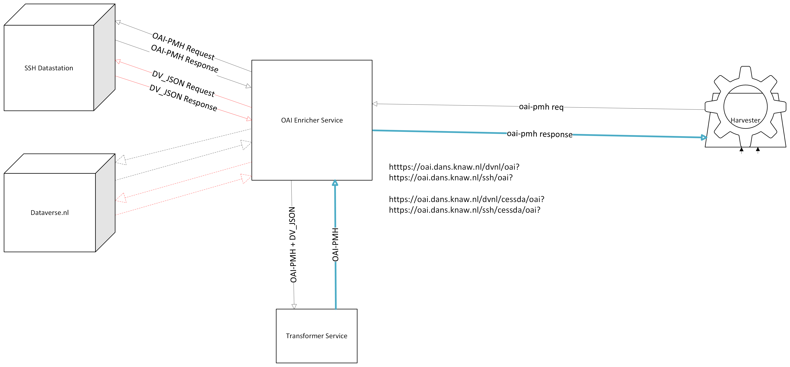

#  OAI Enricher Service

## Project Description
The OAI Enricher Service is a FastAPI-based application designed to enrich OAI-PMH (Open Archives Initiative Protocol for Metadata Harvesting) responses with additional data. It leverages XSLT transformations to process and enhance the metadata retrieved from various repositories. The project uses `poetry` for dependency management and `dynaconf` for configuration management. This service is also Dockerized for easy deployment.



## Installation

### Prerequisites
- Python 3.8 or higher
- `poetry` (Python dependency management tool)

### Steps
1. Clone the repository:
    ```sh
    git clone https://github.com/yourusername/oai-enricher-service.git
    cd oai-enricher-service
    ```

2. Install `poetry` if you haven't already:
    ```sh
    curl -sSL https://install.python-poetry.org | python3 -
    ```

3. Install the required dependencies using `poetry`:
    ```sh
    poetry install
    ```

4. Configure the application settings:
    - Ensure your `settings.toml` file is correctly formatted and located in the `conf` directory.

## Usage

### Running the Application
To start the FastAPI application, run:
```sh
poetry run uvicorn src.main:app --host 0.0.0.0 --port 3947 --reload

```
# `main.py`

## Overview
`main.py` is the main entry point for the OAI Enricher Service, a FastAPI-based application designed to enrich OAI-PMH responses with additional data using XSLT transformations.

## Dependencies
- `fastapi`
- `uvicorn`
- `requests`
- `emoji`
- `saxonche`
- `dynaconf`
- `xml.etree.ElementTree`
- `logging`
- `os`
- `json`

## Application Structure

### FastAPI Application
The FastAPI application is created and configured with CORS middleware to allow cross-origin requests.

### Lifespan Event
An asynchronous context manager is used to handle the application's lifespan events, such as startup and shutdown.

### Endpoints

#### Get Service Name
- **Endpoint:** `GET /`
- **Description:** Returns the service name.
- **Response:**
    ```json
    {
        "service name": "Oai Enricher Service"
    }
    ```

#### List DANS Repositories
- **Endpoint:** `GET /dans-repos`
- **Description:** Lists all keys in the `dans_repo` dictionary.
- **Response:**
    ```json
    ["dvnl", "ss", "ar", "ls", "pt"]
    ```

#### Get Mapping
- **Endpoint:** `GET /{dans_repo}/{mapping}/oai`
- **Description:** Retrieves and processes the OAI-PMH response for a specific repository and mapping.
- **Parameters:**
    - `dans_repo`: The repository key (e.g., `dvnl`).
    - `mapping`: The mapping key.
- **Response:** Processed XML response.

#### Redirect OAI
- **Endpoint:** `GET /{dans_repo}/oai`
- **Description:** Redirects the OAI-PMH request to the specified repository.
- **Parameters:**
    - `dans_repo`: The repository key (e.g., `dvnl`).
- **Response:** Processed XML response.

### Helper Functions

#### `execute_xslt(json_string, xsl, xml_string)`
Executes an XSLT transformation on the provided XML string using the given XSL file and JSON string as parameters.

### Main Execution
The application is started using `uvicorn` when the script is run directly.

## Configuration
The application uses `dynaconf` for configuration management. Ensure your `settings.toml` file is correctly set up in the `conf` directory.

## Example `settings.toml`
```toml
[default]
service_name = "oai-enricher-service"
fastapi_title = "OAI Enricher Service"
fastapi_description = ""
dans_repo = {dvnl = "https://dataverse.nl", ss = "https://ssh.datastations.nl"}
xslt_path = "@format {env[BASE_DIR]}/resources/xslt/cessda.xsl"
log_file = "@format {env[BASE_DIR]}/logs/oes.log"
log_level = 10
log_format = "%(asctime)s %(levelname)s %(name)s %(threadName)s : %(message)s"
expose_port = 3947